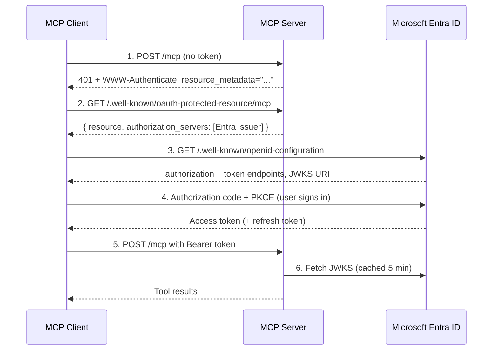

Running the server in `oauth` mode lets MCP clients sign users in interactively through your existing identity provider. Users click **Connect**, complete a normal Microsoft sign-in, and are done — no scripts, no tokens to copy, no per-user setup.

<Info>
**When to use OAuth mode:**
- **Organization-wide rollout**: users authenticate with corporate SSO and existing MFA/conditional access policies
- **Per-user attribution**: the token's `sub` claim identifies the individual who ran each query
- **No credential distribution**: nothing secret is stored on user machines

**When to use something else:**

- **Per-user IBM i credentials**: see [IBM i Authentication](/server-config/ibmi-auth), which pools connections per IBM i user profile
- **Local development**: `MCP_AUTH_MODE=none` with shared `DB2i_USER`/`DB2i_PASS`
  </Info>

The server acts purely as an OAuth **resource server**: it validates the access tokens Entra issues and never handles credentials itself. Entra is the authorization server. Nothing sits between them.

---

## How discovery works

MCP clients do not read your configuration — they discover the authorization server from the server itself.



Steps 1 and 2 are what this server provides. If either is missing, clients cannot locate Entra and the connection fails with a generic "couldn't reach the server" error.

---

## Step 1: Register the resource API in Entra ID

Entra models the API being called and the application calling it as separate registrations, so this takes two: a **resource API** registration that is the token's audience, and a **client** registration that Claude uses to request tokens. A single registration can technically play both parts — don't:

- The client registration holds a secret you hand to a third party, alongside a redirect URI on a domain you do not control. The resource API needs neither; it only validates signatures against Entra's public JWKS.
- Each client gets its own identity in the token's `azp` claim, so you can add, audit, or revoke a second client later without reissuing the API's identity.
- The two enterprise applications gate different questions: assignment on the resource API controls who may query IBM i, assignment on the client controls who may use that client to do it.

<Steps>
  <Step title="Create the resource API registration">
    Create an app registration named, for example, **IBM i MCP API**. Record its **Application (client) ID**; this GUID is the value the server must validate as the v2 access token's `aud` claim.
  </Step>

<Step title="Issue v2 access tokens">
  Open the app registration's **Manifest** and set the requested access token
  version to `2`. The property is `api.requestedAccessTokenVersion` in the
  Microsoft Graph manifest format and top-level `requestedAccessTokenVersion` in
  the Azure AD Graph format; the portal offers both. It defaults to `null`,
  meaning v1, and the editor may omit the key entirely — adding it is expected,
  not a workaround.

The server uses Entra's `/v2.0` issuer and expects a v2 access token. A v1 token
fails validation twice over: it carries a different issuer
(`https://sts.windows.net/<tenant-id>/`) and puts the Application ID URI in
`aud` instead of the client ID.

</Step>

<Step title="Expose the delegated scope">
  Under **Expose an API**, accept the default Application ID URI of
  `api://<application-client-id>`, then add a delegated scope named `ibmi.read`
  that administrators and users can consent to as appropriate for your tenant.

  <Warning>
  The Application ID URI is **not** the MCP server's URL and need not resemble
  it. Entra accepts only [a fixed set of
  formats](https://learn.microsoft.com/entra/identity-platform/security-best-practices-for-app-registration#application-id-uri-also-known-as-identifier-uri):
  an `https://` URI must use a domain verified in your tenant and cannot carry a
  port, so a value like `https://mcp.example.com:8080/mcp` is rejected outright.
  `api://<application-client-id>` always works. `OAUTH_RESOURCE_URL` is a
  separate setting — see Step 3.
  </Warning>
</Step>

  <Step title="Require assignment">
    Open the resource API under **Enterprise applications → Properties** and set **Assignment required?** to **Yes**. Then assign the users or groups allowed to query IBM i under **Users and groups**.

    <Warning>
    Adding users to **Users and groups** does not restrict unassigned users unless **Assignment required?** is enabled.
    </Warning>

  </Step>
</Steps>

---

## Step 2: Register Claude as the OAuth client

<Steps>
  <Step title="Create the client registration">
    Create a second app registration named, for example, **Claude MCP Connector**. This registration represents the confidential OAuth client, not the MCP resource API.
  </Step>

<Step title="Add the callback">
  Under **Authentication**, add `https://claude.ai/api/mcp/auth_callback` as a
  **Web** redirect URI.
</Step>

<Step title="Grant the API permission">
  Under **API permissions**, add the delegated `ibmi.read` permission exposed by
  **IBM i MCP API**, then grant tenant-wide admin consent if your policy
  requires it.
</Step>

  <Step title="Create the client secret">
    Under **Certificates & secrets**, create a secret and copy its value immediately. You will enter this value and the Claude client registration's **Application (client) ID** when adding the connector.
  </Step>
</Steps>

---

## Step 3: Configure the server

```bash
MCP_TRANSPORT_TYPE=http
MCP_AUTH_MODE=oauth

OAUTH_ISSUER_URL=https://login.microsoftonline.com/<tenant-id>/v2.0
OAUTH_JWKS_URI=https://login.microsoftonline.com/<tenant-id>/discovery/v2.0/keys
OAUTH_AUDIENCE=<resource-api-application-client-id-guid>

# Must match the URL users enter in their MCP client exactly, path and port included
OAUTH_RESOURCE_URL=https://mcp.example.com/mcp

# Qualified by the resource API's Application ID URI, not by OAUTH_RESOURCE_URL
OAUTH_SCOPES_SUPPORTED=api://<resource-api-application-client-id-guid>/ibmi.read

# Short scope names required in the access token's scp claim
OAUTH_REQUIRED_SCOPES=ibmi.read
```

| Variable                 | Purpose                                                                                                                                                   |
| ------------------------ | --------------------------------------------------------------------------------------------------------------------------------------------------------- |
| `OAUTH_ISSUER_URL`       | Entra tenant issuer. Published to clients as the authorization server, and used to validate the `iss` claim.                                              |
| `OAUTH_JWKS_URI`         | Signing key set. Optional — defaults to `<issuer>/.well-known/jwks.json`, which is **not** Entra's layout, so set it explicitly.                          |
| `OAUTH_AUDIENCE`         | Validated against the token's `aud` claim. For an Entra v2 access token, use the resource API's Application (client) ID GUID, not its Application ID URI. |
| `OAUTH_RESOURCE_URL`     | The protected resource identifier ([RFC 9728](https://www.rfc-editor.org/rfc/rfc9728)). Required for discovery.                                           |
| `OAUTH_SCOPES_SUPPORTED` | Comma-separated, fully-qualified scopes advertised to clients and included in bearer challenges. Qualified by the resource API's Application ID URI.      |
| `OAUTH_REQUIRED_SCOPES`  | Comma-separated scope names required in every accepted token. Missing scopes return `403 insufficient_scope`.                                             |

<Warning>
  `OAUTH_ISSUER_URL` is the issuer, not an endpoint prefix: it ends in `/v2.0`,
  **not** `/oauth2/v2.0`. The latter is the prefix for Entra's `authorize` and
  `token` endpoints and has no discovery document behind it. Because the server
  both matches this value against the token's `iss` claim and publishes it as
  the authorization server clients discover, the wrong form breaks token
  validation and interactive sign-in at once.
</Warning>

<Warning>
Entra requires the **fully-qualified** scope URI in the authorization request, so `OAUTH_SCOPES_SUPPORTED` uses `<application-id-uri>/<scope>` — for the registration in Step 1, `api://<resource-api-client-id>/ibmi.read`. The issued token's own `scp` claim contains only the short name (`ibmi.read`), which is why `OAUTH_REQUIRED_SCOPES` uses the short value.

`OAUTH_RESOURCE_URL` is a third, unrelated value: this server's public URL exactly as MCP clients address it, port and path included. It never has to match the Application ID URI.

</Warning>

OAuth mode now fails at startup if issuer, audience, protected resource, advertised scopes, or required scopes are missing. Public OAuth URLs must use HTTPS; HTTP is accepted only for loopback development URLs.

Database connections still use the credentials in your `sources:` YAML block. OAuth authenticates the _person_; the IBM i connection uses the configured service profile. Pair this with a read-only IBM i user profile and curated toolsets to bound what any authenticated user can reach.

---

## Step 4: Verify discovery

Before adding the connector, confirm both halves of the handshake:

```bash
# Metadata document — should list your Entra issuer
curl https://mcp.example.com/.well-known/oauth-protected-resource/mcp

# 401 challenge — should carry the resource_metadata pointer
curl -i -X POST https://mcp.example.com/mcp \
  -H "Content-Type: application/json" \
  -d '{"jsonrpc":"2.0","method":"tools/list","id":1}'
```

The second command must return `401` with:

```http
WWW-Authenticate: Bearer resource_metadata="https://mcp.example.com/.well-known/oauth-protected-resource/mcp", scope="api://<resource-api-client-id>/ibmi.read"
```

Both endpoints are served without authentication by design — clients need them before they hold a token.

If a firewall or WAF protects the MCP endpoint, make sure Claude can reach both the metadata URL and `/mcp`. Keep Entra's public authorization, token, discovery, and JWKS endpoints reachable from the client.

---

## Step 5: Add the connector

In Claude, add a custom connector pointing at `https://mcp.example.com/mcp`. Under the advanced OAuth settings, supply the **Claude MCP Connector** Application (client) ID and client secret from Step 2. Users then connect with a Microsoft sign-in.

---

## Troubleshooting

| Symptom                                                                  | Cause                                                                                                                                                                            |
| ------------------------------------------------------------------------ | -------------------------------------------------------------------------------------------------------------------------------------------------------------------------------- |
| Client reports it can't reach the server, and Entra logs show no traffic | Discovery failed. Verify both checks in Step 4 return what's shown.                                                                                                              |
| `AADSTS500011` during authorization                                      | The Application ID URI qualifying `OAUTH_SCOPES_SUPPORTED` does not exist in the tenant. Qualify it with the resource API's actual Application ID URI, not `OAUTH_RESOURCE_URL`. |
| `403` with `insufficient_scope`                                          | The access token does not contain every `OAUTH_REQUIRED_SCOPES` value. Confirm the Claude client has the delegated API permission and requests the fully-qualified scope URI.    |
| `401` with "Token must contain a client identifier claim"                | Token carries none of `client_id`, `azp`, or `appid` — check you're issuing a v2 access token, not an ID token.                                                                  |
| `401` with "OAuth token verification failed"                             | `OAUTH_AUDIENCE` does not match the token's `aud`, the issuer is wrong, or `OAUTH_JWKS_URI` is wrong. For Entra v2, compare `aud` with the resource API's client ID GUID.        |
| Assigned group members can connect, but unassigned users can too         | **Assignment required?** is not enabled on the resource API's enterprise application.                                                                                            |

<Tip>
  Set `MCP_LOG_LEVEL=debug` to log the decoded claims of every verified token —
  the fastest way to diagnose an audience, scope, or issuer mismatch.
</Tip>
